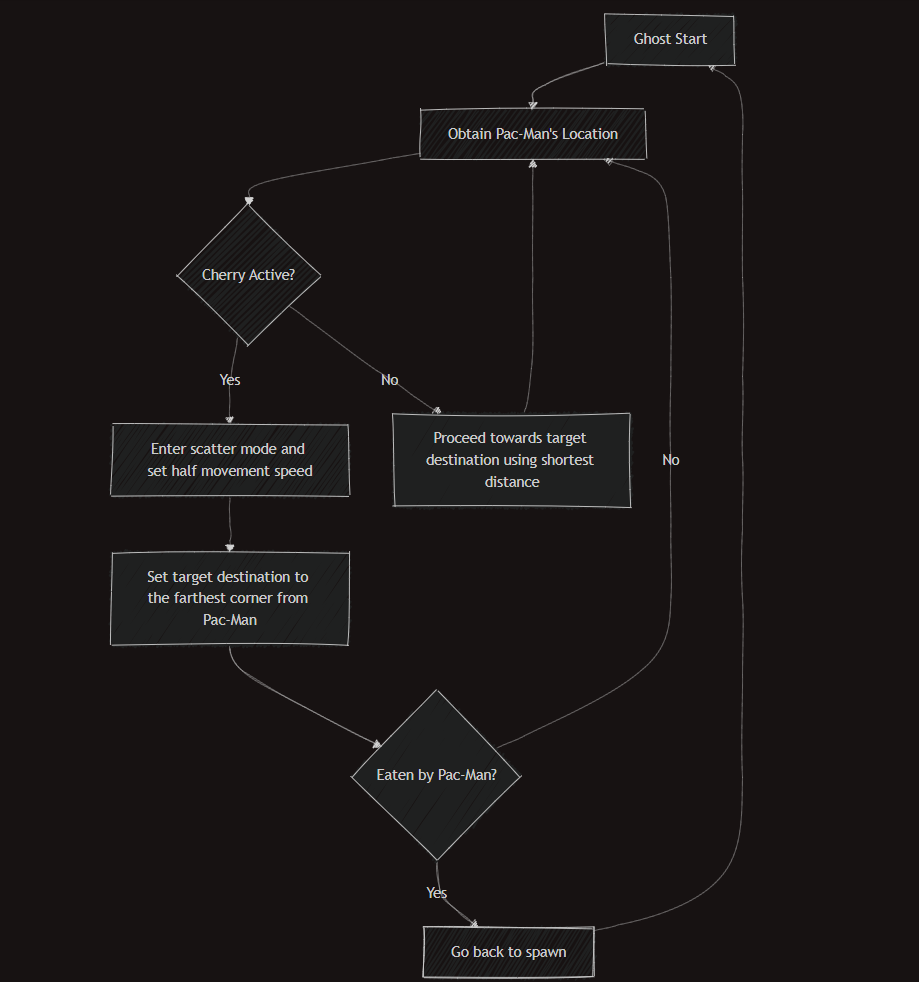

# Pac-Man Simplified

This project is a simplified version of the classic Pac-Man game, designed specifically for integration with ROS (Robot Operating System) to control a MiRo-E robot. The implementation includes only the first level of the game, represented as a grid, allowing for physical reconstruction and interaction with the robot. The integration with ROS has been decoupled from the main game files.

## Project Structure

The project consists of the following files:

- **PacMan.py**: The main game logic and rendering code.
- **constants.py**: Contains game constants, including the level map and configuration parameters.
- **pac_Image_generator.py**: Generates images of Pac-Man for use in the GUI.
- **PacFont.ttf**: A font file used for displaying text in the game.
- **Images**: A folder containing images for the ghosts and other graphical elements.

## Installation

To run the project, ensure you have Python and Pygame installed. You can install Pygame using pip:

```bash
pip install pygame
```

## Usage

1. Clone the repository or download the project files.
2. Navigate to the project directory in your terminal.
3. Run the game using the following command:

```bash
python PacMan.py
```


## File Descriptions

**PacMan.py**

This file contains the core functionality of the game, including:
- **Initialization**: Sets up the Pygame environment, game window, and clock.
- **Game Loop**: Handles user input, updates game state, and renders graphics.

**Classes:**
- **Ghost**: Manages ghost behavior and rendering.

**Functions:**
- **eat_pucks()**: Updates the score and game state when Pac-Man eats pellets.
- **board_spawn()**: Draws the game board based on the level map.
- **scoreboard()**: Displays the current score and lives remaining.

**constants.py**

This file defines essential constants used throughout the game, such as:
- **WIDTH** and **HEIGHT**: Dimensions of the game window.
- **FPS**: Frames per second for the game loop.
- **map**: A 2D array representing the game level layout.
- Other constants related to game mechanics and visuals.

**pac_image_generator.py**

This script is responsible for generating state images for Pac-Man, including different states (normal and cherry mode). It ensures that the images are appropriately scaled and ready for rendering in the game.

- **Functionality**:
  - **draw_pacman(filename, pacman_color, mouth_start, mouth_end)**: Draws a single image of Pac-Man with a specified color, mouth start angle, and mouth end angle. The image is saved with a transparent background to allow for smooth integration in the game.
  - **generate_pacman_images()**: Generates a sequence of images for Pac-Man animation:
    - **Pac-Man**: Images are named from `1.png` to `9.png`, with the mouth angle adjusting incrementally.
    - **Cherry_Pac-Man**: Images are named from `A.png` to `I.png`, with similar incremental mouth angles.


## Assets

- **Images for Ghosts**: The project includes images for ghost characters, stored in `./ghosts`.
- **Images for Pac-Man States**: The project includes images for different Pac-Man States, stored in `./pacman` and `./pacman_cherry`.
- **Font**: The PacFont.ttf file is used to display scores and messages in the game.

## Ghost Behaviour

### Blinky (Red Ghost) Flowchart

<p align="center">
  
</p>


## Gameplay

- **Objective**: Navigate Pac-Man through the maze, avoid ghosts, collect pellets and cherries.
- **Controls**: Use the arrow keys to move Pac-Man in the desired direction.
- **Scoring**:
  - **10 points** for each pellet.
  - **50 points** for a cherry.
  - **200 points** multiplied by the number of ghosts eaten previously (denoted as `count`), where `count` represents the number of ghosts Pac-Man has eaten so far. (Note: Ghosts can only be eaten while Pac-Man is under the influence of a cherry.)
- **Game End Condition**: The game ends when Pac-Man either finishes all the pellets and cherries in the level (`WIN`) or when lives drop to 0 (`LOSE`).

## Current and Future Implementation

As of now, only Blinky (the Red ghost) has been implemented. Work is underway to add the remaining ghosts, each with their unique behaviors. This will enhance the gameplay experience by incorporating the distinct characteristics of each ghost from the classic Pac-Man game. In the future I plan to recreate more levels as well.

## Integration with ROS

This project is designed to be integrated with ROS for controlling a MiRo-E robot. The files related to ROS integration have been decoupled from the main game files.

## License

This project is licensed under the MIT License. See the LICENSE file for more details.
